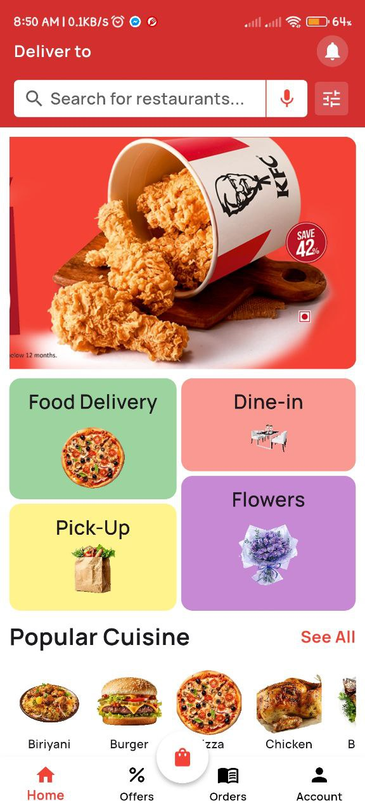
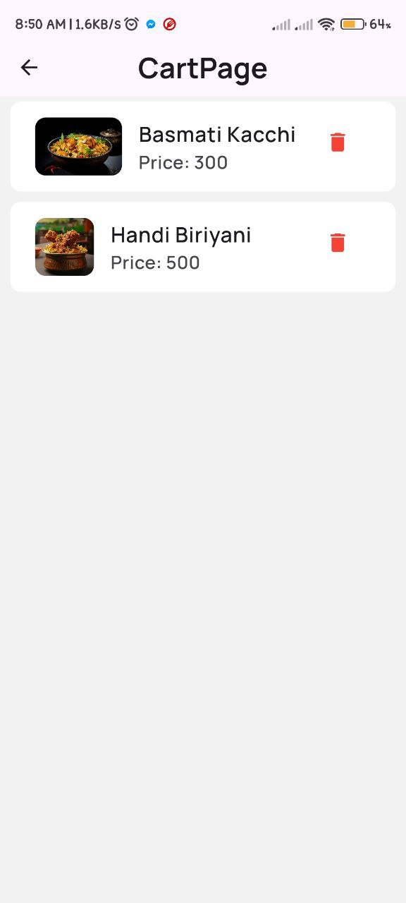
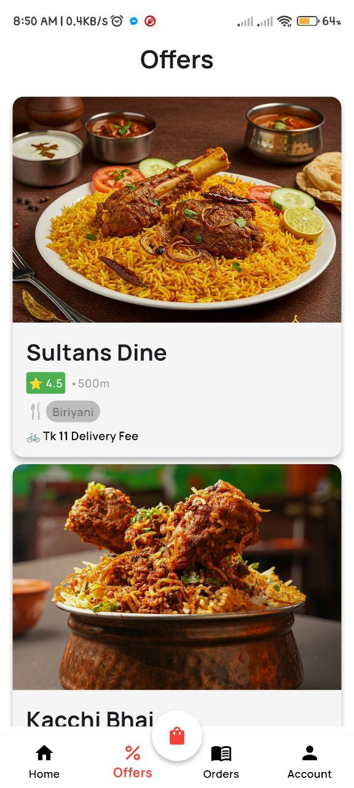
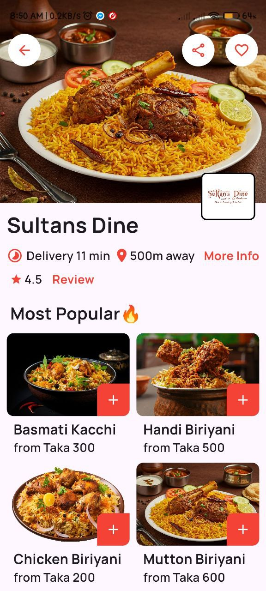

# 🍽️ FoodiApp

A modern and intuitive **food delivery mobile application** built with **Flutter**. FoodiApp allows users to explore restaurants, view menus, place orders, and track their deliveries in real-time.

---

## 📱 Features

- 🏪 Browse restaurants and food items
- 📋 Add items to cart and place orders
- 🧾 View order history

---

## 🛠️ Tech Stack

| Category        | Technologies Used                      |
|----------------|------------------------------------------|
| **Frontend**    | Flutter, Dart                           |

---

## 📸 Screenshots

 
  

---

## 🧑‍💻 Getting Started

### Prerequisites
- Flutter SDK installed
- An emulator or real device to run the app

